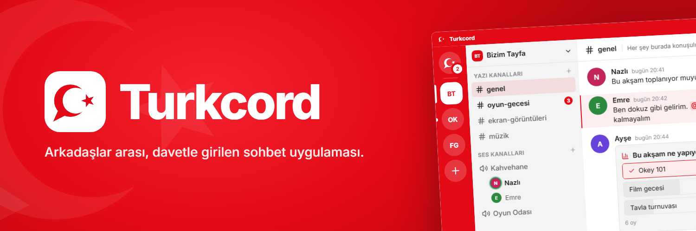
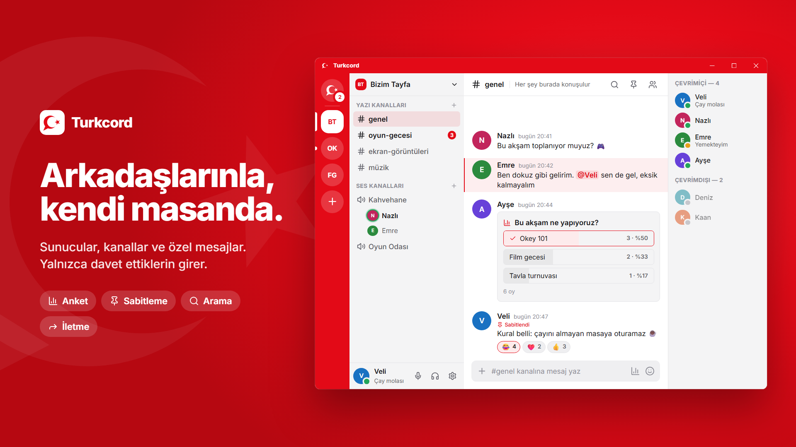
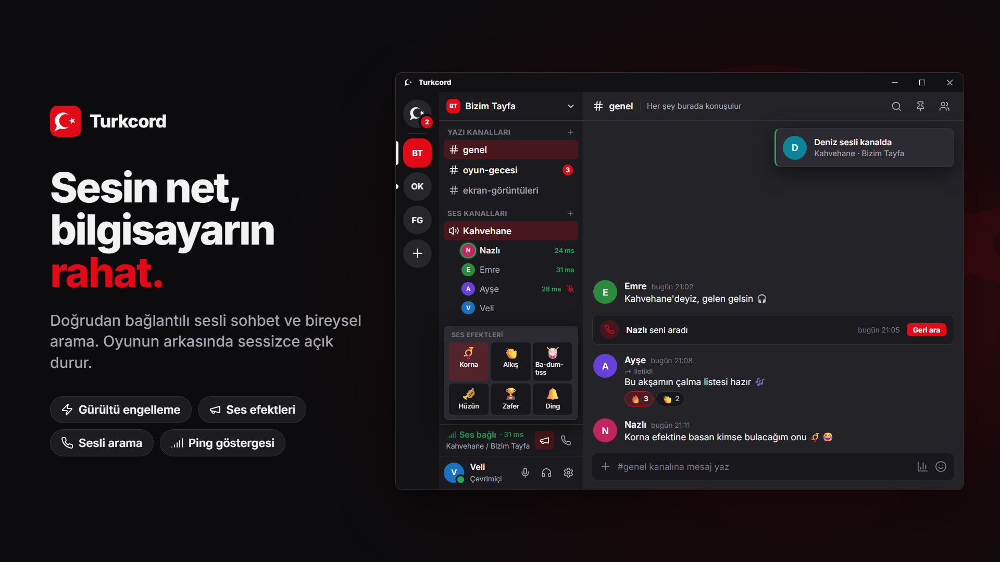
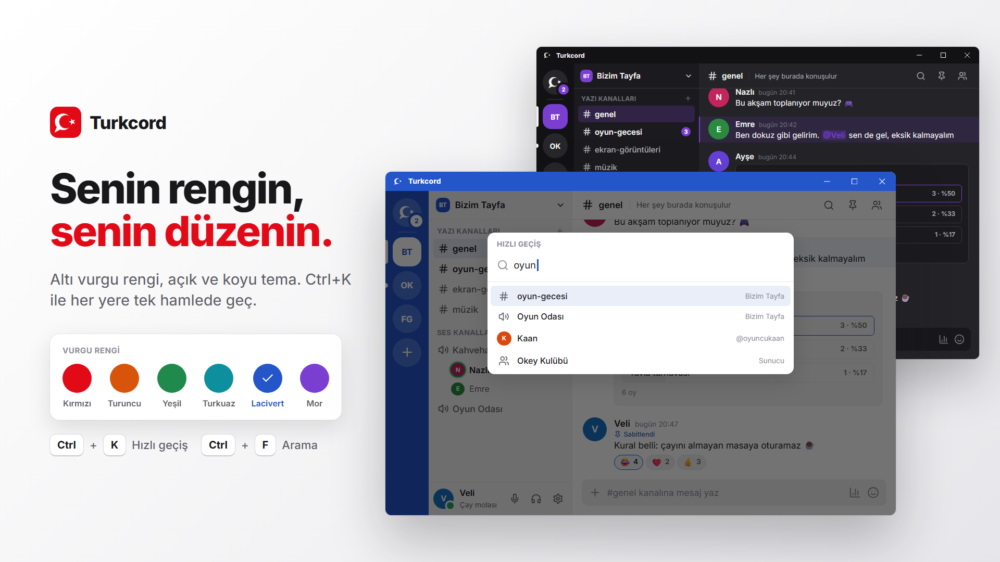

<p align="center">
  
</p>

<h1 align="center">Turkcord</h1>

<p align="center">Arkadaşlar arası, davetle girilen sohbet uygulaması.</p>

---

Turkcord, küçük bir arkadaş grubu için yazılmış bir Windows masaüstü sohbet uygulamasıdır: sunucular, kanallar,
özel mesajlar, sesli sohbet ve bireysel arama. Yalnızca davet kodu olanlar kayıt olabilir. Oyun oynarken arkada
açık kalacağı için az RAM ve işlemci kullanması önceliklidir.

Sunucu tarafında [Supabase](https://supabase.com) kullanır ve ücretsiz planla çalışacak şekilde tasarlanmıştır.

<p align="center">
  
</p>
<p align="center">
  
  
</p>

<sub>Görseller uygulamanın renkleri ve yerleşimiyle çizilmiş tanıtım maketleridir; `tanitim/uret.ps1` ile yeniden üretilir.</sub>

## Özellikler

| Durum | Özellik |
|---|---|
| ✅ | Davet koduyla kayıt, kullanıcı adı + şifreyle giriş |
| ✅ | Profil: avatar, görünen ad, durum mesajı |
| ✅ | Çevrimiçi / Boşta / Rahatsız Etmeyin / Görünmez durumları |
| ✅ | Arkadaş ekleme, istekler, engelleme |
| ✅ | Özel mesajlar (DM) |
| ✅ | Sunucu kurma, sunucu fotoğrafı, davet kodlarıyla katılma, yetkiler (sahip / yönetici / üye) ve renkli özel roller |
| ✅ | Yazı kanalları: anlık mesajlar, yanıtlama, düzenleme, silme, kopyalama, emoji tepkileri |
| ✅ | Dosya gönderme: görsel, ses, video ve her tür dosya (25 MB'a kadar), sürükle-bırak, yükleme ilerlemesi |
| ✅ | Biçimlendirme (**kalın**, *italik*, `kod`, spoiler), otomatik tamamlamalı @etiketleme, "yazıyor…" göstergesi |
| ✅ | Sohbette arama (Ctrl+F), sabitlenmiş mesajlar, anket, mesaj iletme, özel mesajda "Görüldü" |
| ✅ | Hızlı geçiş (Ctrl+K), kanal / sunucu / özel mesaj sessize alma (süreli ya da süresiz), sesli kanala giriş bildirimi |
| ✅ | Bildirimler: ayarlanabilir sesler, uygulama içi bildirim kartları, masaüstü bildirimleri, okunmamış rozetleri |
| ✅ | "Yeni mesajlar" çizgisi, en alta in düğmesi, açık tema ve üç koyu ton (koyu, gece, tam siyah), altı vurgu rengi, yazı boyutu, sıkışık görünüm, kendi başlık çubuğu |
| ✅ | Yönetici paneli: davet kodları, şifre sıfırlama, hesap askıya alma, depolama kullanımı ve temizlik |
| ✅ | Ses odası: kanaldakiler büyük kartlarla, konuşan çerçevesi, ping ve seste geçen süre |
| ✅ | Sesli sohbet: P2P WebRTC, konuşan göstergesi, ping göstergesi, susturma/sağırlaştırma, kişi başı ses ayarı, cihaz seçimi |
| ✅ | Bireysel sesli arama: özel mesajdan arama, mehter arama melodisi (ya da kendi ses dosyan), cevapsız arama kaydı |
| ✅ | Ses efektleri: ses kanalında ya da aramada herkese çalan korna, alkış, ba-dum-tıss… |
| ✅ | Yapay zekâ gürültü engelleme (RNNoise), giriş hassasiyeti, yankı engelleme, bas-konuş |
| ✅ | Mehter temalı sesler: bildirimler, arama melodisi ve ses kanalı işaretleri "Ceddin Deden"in notalarından sentezlenir |
| ✅ | Otomatik güncelleme: açılışta küçük bir pencere yeni sürümü denetler, varsa uygulama açılmadan kurar; çalışırken arka planda iner |
| ✅ | Sistem tepsisi, Windows açılışında başlatma, oyundayken de çalışan mikrofon/sağırlaştırma kısayolları |

## Arkadaşlar için kurulum

1. [Releases](https://github.com/Esehannn/turkcord/releases) sayfasından `Turkcord-Kurulum-x.y.z.exe` dosyasını indir.
2. Çalıştır. Windows "Bilgisayarınız korundu" derse **Ek bilgi → Yine de çalıştır**'a bas
   (uygulama imzasız olduğu için bu uyarı çıkar).
3. Yöneticiden aldığın davet koduyla **Kayıt Ol**.

## Geliştirme

Gerekenler: Node.js 22+, bir Supabase projesi.

```bash
npm install
cp .env.example .env   # Supabase adresini ve herkese açık (publishable) anahtarı yaz
npm run dev            # uygulamayı geliştirme modunda açar
```

| Komut | Ne yapar |
|---|---|
| `npm run typecheck` | TypeScript kontrolü |
| `npm test` | Birim testleri (biçimlendirme, şifre ve kullanıcı adı kuralları, dosya ve arama yardımcıları) |
| `npm run test:db` | Migration'ları boş bir Postgres'e kurup güvenlik (RLS) testlerini çalıştırır. `TEST_DATABASE_URL` gerekir. |
| `npm run build` | Uygulamayı derler |
| `npm run dist:win` | Windows kurulum dosyası üretir (Linux'ta `wine` gerekir) |

### Yapı

```
src/main        Electron ana süreci (pencere, güvenlik ayarları, şifreli oturum deposu)
src/preload     Arayüze açılan küçük köprü (window.turkcord)
src/renderer    React arayüzü
src/shared      Uygulama ve sunucunun ortak kuralları (kullanıcı adı, şifre)
supabase/       Veritabanı migration'ları, Edge Function'lar, testler
```

### Veritabanı

Tüm tablo, yetki ve kurallar `supabase/migrations` altındadır. Supabase'in GitHub entegrasyonu `main` dalına
gelen yeni migration'ları ve `supabase/config.toml`'da tanımlı Edge Function'ları kendisi uygular.

Kendi Supabase projeni kurmak için [docs/KURULUM.md](docs/KURULUM.md) dosyasına bak.

## Güvenlik

Güvenlik modeli ve açık bildirme için [SECURITY.md](SECURITY.md) dosyasına bak. Özetle:

- Repoda hiçbir gizli anahtar yoktur. Uygulamadaki Supabase anahtarı herkese açık (publishable) anahtardır;
  erişim veritabanındaki satır seviyesinde güvenlik (RLS) kurallarıyla sınırlanır.
- Kayıt sadece geçerli bir davet koduyla yapılabilir; bu kontrol veritabanında zorunlu tutulur.
- Mesajlar HTML olarak işlenmez; Electron penceresi sandbox ve sıkı bir CSP ile çalışır.
